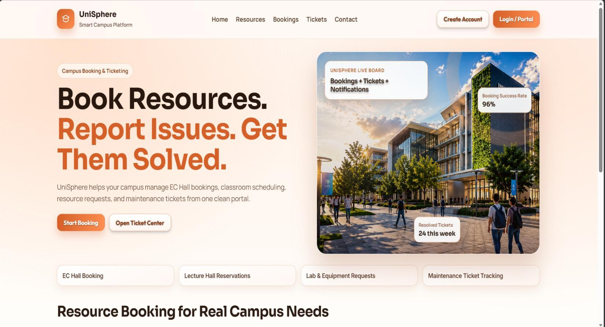

# Uni Sphere - Smart Campus Operations Hub

A group-built smart campus web application for managing campus resources, booking requests, maintenance tickets, users, authentication, and real-time notifications.

## Project Overview

Uni Sphere, also used in the UI as UniSphere, was developed as a group full-stack web application for the Programming Applications and Frameworks (IT3030) module in Year 3 Semester 1. The project focuses on a university campus service-management workflow where students can discover and book resources, admins can manage facilities and approvals, and technicians can track assigned maintenance work.

The system connects a React + Vite frontend with a Spring Boot REST API backend and a MySQL database. It brings together resource management, booking conflict checking, incident ticketing, role-based access, JWT authentication, Google OAuth2, Face ID login, profile management, local file uploads, and WebSocket-based notifications.

## Team Contribution Summary

Student IDs are included because this is an academic group project and the contribution mapping is part of the course context.

| Member | Main Contribution |
| --- | --- |
| IT23629226 - Bhagya S.S | Facilities catalogue and resource management |
| IT23590526 - Kavinda B.Y | Booking workflow and conflict checking |
| IT23774148 - Marasinghe L.M.M | Incident tickets, attachments, comments, and technician updates |
| IT23687882 - Maduvinda D.K.A | Authentication, authorization, role management, OAuth integration, and notifications |

This README explains the complete system as a group project, while also making each member's contribution clear.

**My Contribution:** Authentication, Authorization, Notifications, Role Management, Google OAuth2, Face ID login, JWT with HTTP-only cookies, protected routes, and real-time notification flow.

## Documentation

The project documentation is separated into two PDF files to keep the README clean and easy to read.

- [View Project Documentation PDF](./docs/project-documentation.pdf)
- [View UI Screenshots PDF](./docs/ui-screenshots.pdf)

The project documentation PDF includes the system overview, technology stack, team contribution mapping, architecture diagrams, ER/database explanation, authentication and authorization flow, OAuth2 and Face ID flow, booking workflow, maintenance ticket workflow, notification workflow, setup notes, GitHub evidence, and testing evidence.

The UI screenshots PDF includes the main application screens such as the landing page, signup, forgot password, login, Face ID login, profile, settings, admin dashboard, technician dashboard, notifications, resource pages, booking pages, and ticket pages.

This README still gives a code-level explanation of the project so readers do not need to depend only on the PDFs.

## UI Preview



The complete UI walkthrough is available in the UI screenshots PDF.

## Tech Stack

| Layer | Technologies |
| --- | --- |
| Frontend | React 19, Vite 5, React Router DOM 7, Axios, face-api.js |
| Backend | Java 17, Spring Boot 3.3.5, Maven, Spring Web, Spring Security, Spring Data JPA, Spring Validation, Spring Mail, Spring WebSocket |
| Database | MySQL is the active local configuration through `jdbc:mysql://localhost:3306/smart_campus`; PostgreSQL driver is also present as a runtime dependency but is not the active configured database |
| Authentication & Security | JWT, refresh tokens, HTTP-only cookies, BCrypt, Spring Security filter chain, OTP, Google OAuth2 |
| Real-time | Spring WebSocket, custom notification WebSocket handler |
| File Handling | Local filesystem uploads served through `/uploads/**` |
| Tools | GitHub, Postman, IntelliJ IDEA, VS Code, Maven Wrapper, ESLint, browser testing |

## Key Features

- **User Registration & OTP Verification** - Users register with an IT-number based SLIIT email such as `IT23687882@my.sliit.lk`, then verify the account through OTP.
- **Email/Password Login** - Verified users can log in through Spring Security authentication.
- **Google OAuth2 Login** - Google OAuth2 sign-in is handled through Spring Security OAuth2 and a custom success handler.
- **Face ID Login** - The frontend uses face-api.js to capture a 128-value face descriptor, and the backend compares it with the stored descriptor.
- **JWT Authentication** - Access, refresh, and verify tokens are generated with JJWT.
- **HTTP-only Cookie Handling** - Auth tokens are written into HTTP-only cookies to avoid storing them in browser JavaScript state.
- **Role-Based Access Control** - USER, ADMIN, and TECHNICIAN roles are used for role-based dashboards and service-level ticket permissions.
- **User Profile Management** - Users can update profile fields, password, email, phone number, year, semester, profile image, and cover image.
- **Resource Management** - Campus resources such as lecture halls, labs, meeting rooms, and equipment can be created, viewed, edited, and deleted.
- **Booking Management** - Users can create booking requests and admins can review booking status.
- **Booking Conflict Checking** - The booking service checks date/time overlap for pending and approved bookings.
- **Maintenance Ticket Management** - Users can create maintenance tickets with category, priority, location, contact number, attachments, and comments.
- **Technician Assignment** - Admins can assign tickets to TECHNICIAN users.
- **Ticket Status Updates** - Admins and assigned technicians can update ticket progress.
- **Real-Time Notifications** - Booking and ticket events create notifications and push updates through WebSocket when the user is connected.
- **Notification Panel** - Users can view unread count, load recent notifications, mark one as read, mark all as read, and delete notifications.
- **Responsive React UI** - The frontend provides browser-based dashboards and workflows for users, admins, and technicians.

## Advanced Features

### Secure Authentication Flow

Registration validates institutional email format, hashes passwords with BCrypt, stores a verification OTP with expiry, and enables the account only after OTP verification. Login checks account verification before issuing JWT access and refresh cookies.

### OAuth2 and Face ID Login

Google OAuth2 uses a custom success handler that validates the provider email, creates or updates a local user, issues JWT cookies, and redirects back to the frontend. Face login uses face-api.js model files in `client/public/models`, captures a descriptor in the browser, and verifies it in the backend using a configurable similarity threshold.

### JWT and Cookie-Based Session Handling

`JwtUtils` creates ACCESS, REFRESH, and VERIFY cookies with HTTP-only flags, configurable SameSite behavior, and separate lifetimes. The Axios client sends cookies with every request and retries failed authenticated requests through `/auth/refresh`.

### Role-Based Access Control

The system uses `Role.USER`, `Role.ADMIN`, and `Role.TECHNICIAN`. The frontend redirects users to role-specific dashboards, while the backend protects non-auth endpoints through Spring Security and enforces ticket assignment/status permissions inside the ticket service.

### Real-Time Notification System

Booking and ticket services call `NotificationService` when important events happen. Notifications are persisted in MySQL and pushed to connected users through `/ws/notifications` using a custom `NotificationRealtimeGateway`.

### Layered Backend Architecture

The backend separates controllers, services, repositories, DTOs, entities/models, security classes, exception handling, utilities, and WebSocket components. This keeps API routing, business logic, persistence, and security concerns easier to follow.

### Resource and Booking Workflow

Resources store type, capacity, location, availability time, status, description, and image URL. Bookings store facility name, booking date/time, attendees, purpose, requester label, and status, with conflict validation before saving.

### Ticket and Technician Workflow

Tickets start as `OPEN`, can be assigned to technicians, and move through statuses such as `IN_PROGRESS`, `RESOLVED`, `CLOSED`, and `REJECTED`. Attachments are stored locally, comments are linked to tickets, and status/comment changes can notify the relevant users.

### Frontend Route Protection

The React app uses route-level pages with session checks against `/auth/me` or `/user/me`. Pages redirect users based on role, and role-specific dashboards expose the workflows relevant to users, admins, and technicians.

### Clean Documentation Setup

The repository now keeps project documentation and UI screenshots under `docs/`, while the README gives a shorter technical walkthrough for developers, lecturers, and reviewers.

## System Architecture

```txt
User / Admin / Technician
        |
        v
React + Vite Frontend
        |
        v
Axios API Client with HTTP-only cookies
        |
        v
Spring Security + JWTAuthFilter + OAuth2 Flow
        |
        v
Spring Boot REST Controllers
        |
        v
Service Layer
        |
        v
Repository Layer
        |
        v
MySQL Database

Booking / Ticket Events
        |
        v
NotificationService
        |
        v
NotificationRepository + NotificationRealtimeGateway
        |
        v
WebSocket /ws/notifications
        |
        v
React NotificationBell
```

## Folder Structure

Current important project structure:

```txt
it3030-paf-2026-smart-campus-Group_Project-WE-42/
|
|-- client/
|   |-- public/
|   |   |-- images/
|   |   |   `-- landing-campus.png
|   |   `-- models/
|   |       `-- face-api.js model files
|   |-- src/
|   |   |-- api.js
|   |   |-- auth/
|   |   |-- comp/
|   |   |-- components/
|   |   |-- pages/
|   |   |-- services/
|   |   `-- utils/
|   |-- package.json
|   |-- package-lock.json
|   |-- vite.config.js
|   `-- eslint.config.js
|
|-- server/
|   |-- postman/
|   |   `-- SmartCampus-Resource-CRUD.postman_collection.json
|   |-- src/main/java/com/smartcampus/
|   |   |-- config/
|   |   |-- controller/
|   |   |-- dto/
|   |   |-- entity/
|   |   |-- enums/
|   |   |-- exception/
|   |   |-- model/
|   |   |-- records/
|   |   |-- repository/
|   |   |-- security/
|   |   |-- service/
|   |   |-- utils/
|   |   `-- websocket/
|   |-- src/main/resources/application.properties
|   |-- pom.xml
|   |-- mvnw
|   `-- mvnw.cmd
|
|-- docs/
|   |-- project-documentation.pdf
|   |-- ui-screenshots.pdf
|   `-- screenshots/
|       `-- landing-page.jpg
|
|-- uploads/
|-- README.md
`-- .gitignore
```

The main structure is understandable because the frontend and backend are separated. A safe future cleanup is to keep all documentation in `docs/`, keep runtime uploads out of Git tracking, and avoid committing local IDE/tool cache folders unless the team intentionally needs them.

Suggested long-term structure:

```txt
project-root/
|
|-- client/        # React frontend
|-- server/        # Spring Boot backend
|-- docs/          # Project report, UI screenshots, diagrams
|-- uploads/       # Local runtime uploads only, normally ignored
|-- README.md
`-- .gitignore
```

## Backend Overview

The backend handles the main business logic of the system, including authentication, resource management, booking approvals, ticket handling, technician assignment, comments, file uploads, and notifications. It is implemented as a Spring Boot application under the `com.smartcampus` package.

Important backend areas:

- `controller/` exposes REST APIs for auth, users, resources, bookings, tickets, forgot password, and notifications.
- `service/` contains business logic such as OTP verification, face login comparison, booking conflict checking, ticket assignment rules, notification creation, and profile updates.
- `repository/` uses Spring Data JPA for persistence.
- `model/` and `entity/` contain JPA entities such as `User`, `Resource`, `Booking`, `MaintenanceTicket`, `Attachment`, `Comment`, `Notification`, and `ForgotPassword`.
- `dto/` contains request/response objects with validation annotations.
- `security/` contains Spring Security configuration, JWT filtering, OAuth2 success handling, OAuth2 cookie request storage, and BCrypt authentication setup.
- `websocket/` contains the real-time notification gateway and WebSocket handler.
- `exception/GlobalExceptionHandler.java` handles validation, not-found, data integrity, response status, runtime, and generic errors.

The backend runs on port `8081` by default.

## Frontend Overview

The frontend is a React + Vite application. It uses React Router DOM for routes, Axios for backend calls, face-api.js for browser-side face descriptor extraction, and page-level session checks for protected workflows.

Main frontend areas:

- `src/api.js` configures Axios with `withCredentials: true` and refresh-token retry handling.
- `src/auth/auths/` contains login, signup, OTP verification, and OAuth2 success pages.
- `src/auth/user/` contains role-based home/dashboard/profile/settings pages and technician ticket views.
- `src/pages/` contains resource, booking, ticket, and landing pages.
- `src/components/NotificationBell.jsx` manages notification loading, unread count, WebSocket connection, mark-as-read, mark-all-read, and delete actions.
- `src/services/` wraps resource, booking, and notification API calls.
- `src/utils/faceRecognition.js` loads face-api.js models, opens the camera, captures descriptors, and handles camera/model errors.

Main routes include `/`, `/login`, `/signup`, `/verify`, `/oauth-success`, `/home`, `/dashboard`, `/techhome`, `/profile`, `/settings`, `/bookings`, `/my-bookings`, `/admin/bookings`, `/tickets`, `/admin/tickets`, and `/technician/my-tickets`.

The frontend runs on port `5173` by default when using Vite.

## Database Overview

The active local database configuration uses MySQL:

```properties
spring.datasource.url=jdbc:mysql://localhost:3306/smart_campus
spring.datasource.driver-class-name=com.mysql.cj.jdbc.Driver
spring.jpa.hibernate.ddl-auto=update
```

The backend uses JPA/Hibernate to persist application data. Main tables/entities include:

| Entity / Table | Main Purpose |
| --- | --- |
| `users` | User accounts, roles, OTP fields, OAuth provider data, refresh token, face descriptor, profile data |
| `forgot_password` | Forgot-password OTP, expiry, resend count, and recovery metadata |
| `resources` | Campus facilities/resources with type, capacity, location, availability, status, description, and image URL |
| `bookings` | Facility booking request details, date/time range, attendees, purpose, requester label, and status |
| `maintenance_tickets` | Reported incidents with priority, status, reporter, assigned technician, notes, location, and contact number |
| `attachments` | Local file metadata connected to maintenance tickets |
| `comments` | Ticket discussion comments linked to users and tickets |
| `notifications` | User notifications with type, target type, target id, message, read state, and created time |

Important relationships:

- A `User` can own a forgot-password record.
- A `User` can report many maintenance tickets.
- A `User` with TECHNICIAN role can be assigned to many tickets.
- A `MaintenanceTicket` can have many attachments and comments.
- A `Notification` belongs to one user and points to a booking or ticket using `targetType` and `targetId`.
- A `Resource` can be linked to maintenance tickets through the optional `resource` field.

## Authentication, Authorization & Security

The authentication flow supports registration, OTP verification, login, logout, refresh-token renewal, forgot password, password updates, Google OAuth2, and Face ID login.

Security details implemented in the codebase:

- Registration validates an institutional email pattern such as `IT23687882@my.sliit.lk`.
- Passwords are hashed with BCrypt through Spring Security's `PasswordEncoder`.
- Signup OTPs are emailed and expire before account activation.
- Forgot-password OTPs are emailed, stored with expiry, and followed by a short-lived VERIFY JWT cookie before password change.
- Login issues ACCESS and REFRESH JWTs through HTTP-only cookies.
- `/auth/refresh` rotates both access and refresh cookies when the refresh token is valid and matches the stored token.
- `JWTAuthFilter` reads Bearer tokens or the ACCESS cookie and populates the Spring Security context.
- OAuth2 login uses Google, validates the email, creates or updates the user, and issues JWT cookies.
- Face login compares a submitted 128-value descriptor with the stored descriptor.
- Frontend pages redirect users based on role and session state.
- Ticket assignment is restricted to admins in the service layer.
- Ticket status updates are restricted to admins or the assigned technician in the service layer.

Implementation note: several admin-oriented resource and booking actions are gated in the frontend and protected by authenticated backend access, but they should be strengthened with endpoint-level role rules such as `@PreAuthorize` or explicit Spring Security matchers before production deployment.

Sensitive configuration values such as database passwords, email app passwords, JWT secrets, OAuth client secrets, and API keys should not be committed to GitHub. They should be stored locally using environment variables or ignored configuration files.

## Security & Configuration Notes

This project requires local configuration values such as database credentials, mail credentials, JWT secrets, OAuth client credentials, frontend redirect URLs, and other environment-specific settings.

Real secret values should not be committed to GitHub. A safe example configuration file should be provided so another developer can understand the required structure without seeing private values.

Recommended example files:

- `.env.example`
- `application-example.properties`
- `application-example.yml`

If a sensitive file was already tracked by Git, remove it from Git tracking without deleting the local file:

```bash
git rm --cached path/to/file
```

Then add the file path to `.gitignore`.

This keeps the local project working while preventing private credentials from being pushed to GitHub.

> Important: If a secret was committed before being removed, the latest repo can be clean while the old value may still exist in Git history. In that case, rotate the exposed database password, mail app password, JWT secret, and OAuth client secret.

## API Endpoints

The tables below list the main endpoints found in the current backend controllers.

### Authentication APIs

| Method | Endpoint | Description | Auth Required |
| --- | --- | --- | --- |
| POST | `/auth/register` | Register a user, store optional face descriptor, and send OTP | No |
| POST | `/auth/login` | Email/password login and issue JWT cookies | No |
| POST | `/auth/face/login` | Face descriptor login and issue JWT cookies | No |
| POST | `/auth/verify-code` | Verify signup OTP using registration email cookie | No |
| POST | `/auth/resend-otp` | Resend signup OTP using registration email cookie | No |
| POST | `/auth/check-phone` | Check phone number availability | No |
| POST | `/auth/refresh` | Rotate ACCESS and REFRESH cookies | Refresh cookie required |
| GET | `/auth/me` | Return current authenticated user | Yes |
| POST | `/auth/logout` | Clear auth cookies and session | Yes |
| GET | `/oauth2/authorization/google` | Start Google OAuth2 login | No |

### Forgot Password APIs

| Method | Endpoint | Description | Auth Required |
| --- | --- | --- | --- |
| POST | `/forgotpass/send-otp` | Send password reset OTP | No |
| POST | `/forgotpass/resend-otp` | Resend password reset OTP | Forgot email cookie |
| POST | `/forgotpass/verify-otp` | Verify reset OTP and issue VERIFY cookie | Forgot email cookie |
| POST | `/forgotpass/change-password` | Change password after OTP verification | VERIFY cookie |

### User/Profile APIs

| Method | Endpoint | Description | Auth Required |
| --- | --- | --- | --- |
| GET | `/user/me` or `/api/user/me` | Get current user profile | Yes |
| GET | `/user/home` or `/api/user/home` | Get user home summary | Yes |
| PUT | `/user/update-name` | Update first and last name | Yes |
| PUT | `/user/update-email` | Start email update with OTP | Yes |
| POST | `/user/verify-new-email` | Confirm new email with OTP | Yes |
| PUT | `/user/update-password` | Update account password | Yes |
| POST | `/user/upload-profile-image` | Upload profile image | Yes |
| POST | `/user/upload-cover-image` | Upload cover image | Yes |
| PUT | `/user/update-phone` | Update phone number | Yes |
| PUT | `/user/update-year` | Update academic year | Yes |
| PUT | `/user/update-semester` | Update semester | Yes |
| DELETE | `/user/delete` | Delete local account after password check | Yes |
| DELETE | `/user/delete-oauth` | Delete OAuth account | Yes |

### Resource APIs

| Method | Endpoint | Description | Auth Required |
| --- | --- | --- | --- |
| POST | `/api/resources` | Create a resource | Yes |
| GET | `/api/resources` | Get all resources | Yes |
| GET | `/api/resources/{id}` | Get one resource | Yes |
| PUT | `/api/resources/{id}` | Update a resource | Yes |
| DELETE | `/api/resources/{id}` | Delete a resource | Yes |

### Booking APIs

| Method | Endpoint | Description | Auth Required |
| --- | --- | --- | --- |
| POST | `/api/bookings` | Create booking request with conflict validation | Yes |
| GET | `/api/bookings` | Get all bookings | Yes |
| GET | `/api/bookings/search` | Search bookings by facility/date/status | Yes |
| GET | `/api/bookings/page` | Get paginated bookings | Yes |
| GET | `/api/bookings/advanced-search` | Advanced paginated booking search | Yes |
| GET | `/api/bookings/dashboard` | Get booking dashboard stats | Yes |
| GET | `/api/bookings/{id}` | Get one booking | Yes |
| PUT | `/api/bookings/{id}` | Update booking details | Yes |
| PATCH | `/api/bookings/{id}/status` | Update booking status | Yes |
| DELETE | `/api/bookings/{id}` | Delete booking | Yes |

### Ticket APIs

| Method | Endpoint | Description | Auth Required |
| --- | --- | --- | --- |
| GET | `/api/tickets/assignable-users` | Get TECHNICIAN users for assignment | Yes |
| GET | `/api/tickets/my-assigned` | Get tickets assigned to the current technician | Yes |
| POST | `/api/tickets` | Create ticket with multipart attachments | Yes |
| GET | `/api/tickets` | Get all tickets | Yes |
| GET | `/api/tickets/{id}` | Get ticket details | Yes |
| PUT | `/api/tickets/{id}/status` | Update ticket status with optional notes | Yes |
| PUT | `/api/tickets/{id}/assign` | Assign technician to ticket | Yes |
| POST | `/api/tickets/{id}/comments` | Add ticket comment | Yes |
| DELETE | `/api/tickets/{ticketId}/comments/{commentId}` | Delete own/admin ticket comment | Yes |

### Notification APIs

| Method | Endpoint | Description | Auth Required |
| --- | --- | --- | --- |
| GET | `/api/notifications` | Get current user's notifications | Yes |
| GET | `/api/notifications/unread-count` | Get unread notification count | Yes |
| PATCH | `/api/notifications/{id}/read` | Mark one notification as read | Yes |
| PATCH | `/api/notifications/read-all` | Mark all notifications as read | Yes |
| DELETE | `/api/notifications/{id}` | Delete one notification | Yes |
| WS | `/ws/notifications` | Real-time notification channel | Yes |

## Installation & Setup Guide

### Prerequisites

- Java 17
- Maven or the included Maven Wrapper
- Node.js and npm
- MySQL
- Git
- Google OAuth2 client credentials if testing Google login
- Gmail app password or another SMTP credential if testing email OTP locally

### Clone the Repository

```bash
git clone <repo-url>
cd it3030-paf-2026-smart-campus-Group_Project-WE-42
```

### Backend Setup

Create a MySQL database:

```sql
CREATE DATABASE smart_campus;
```

Configure local backend values in `server/src/main/resources/application.properties` or through your local environment/configuration approach. Do not commit real secret values.

Example backend configuration structure:

```properties
server.port=8081

spring.datasource.url=jdbc:mysql://localhost:3306/smart_campus
spring.datasource.username=your_database_username
spring.datasource.password=your_database_password
spring.datasource.driver-class-name=com.mysql.cj.jdbc.Driver

spring.jpa.hibernate.ddl-auto=update

spring.mail.host=smtp.gmail.com
spring.mail.port=587
spring.mail.username=your_email_username
spring.mail.password=your_email_app_password

spring.jwt.secret=your_base64_jwt_secret

spring.cookie.secure=false
spring.cookie.same-site=Lax
app.auth.face-similarity-threshold=0.4

spring.security.oauth2.client.registration.google.client-id=your_google_client_id
spring.security.oauth2.client.registration.google.client-secret=your_google_client_secret
spring.security.oauth2.client.registration.google.scope=email,profile
spring.security.oauth2.client.registration.google.redirect-uri=http://localhost:8081/login/oauth2/code/google

app.frontend.base-url=http://localhost:5173
app.frontend.login-url=http://localhost:5173/login
app.frontend.oauth-success-path=/oauth-success
```

Run the backend:

```bash
cd server
./mvnw spring-boot:run
```

On Windows PowerShell:

```powershell
cd server
.\mvnw.cmd spring-boot:run
```

### Frontend Setup

Optional frontend environment variable:

```env
VITE_API_BASE_URL=http://localhost:8081
```

Run the frontend:

```bash
cd client
npm install
npm run dev
```

Local URLs:

| Service | URL |
| --- | --- |
| Backend API | `http://localhost:8081` |
| Frontend | `http://localhost:5173` |
| Google OAuth2 Redirect URI | `http://localhost:8081/login/oauth2/code/google` |
| WebSocket Notifications | `ws://localhost:8081/ws/notifications` |

## UI Screenshots & Preview

The README shows only one preview image to keep the front page readable.


The complete UI walkthrough is available in the UI screenshots PDF:

- [View UI Screenshots PDF](./docs/ui-screenshots.pdf)

The UI documentation covers the landing page, signup, login, Face ID login, forgot password, profile, settings, admin dashboard, technician dashboard, resource pages, booking pages, ticket pages, notification panel, and OAuth2 success flow.

## Testing Evidence

The project documentation PDF contains manual testing and Postman/browser testing evidence for the implemented modules. The backend also includes Spring Boot and Spring Security test dependencies, but a full automated test suite is not visible in the current repository structure. Adding automated backend and frontend tests would be a useful next improvement.

## Challenges & What We Learned

While working on this project, our team improved our understanding of building a full-stack web application with a secure backend, React routing, database integration, file uploads, role-based access, and real-time notifications.

The project required us to connect different modules into one workflow: resources feed into bookings, booking status changes create notifications, tickets support attachments and comments, technicians receive assigned work, and authentication controls access across the system.

My part helped me understand authentication, authorization, OAuth2, Face ID login, JWT cookie handling, role-based redirects, secure profile flows, and notification delivery more deeply.

## Future Improvements

- Add backend method-level role restrictions for admin resource and booking APIs.
- Add automated tests for authentication, booking conflicts, ticket permissions, and notification behavior.
- Improve API documentation with Swagger/OpenAPI.
- Move all private configuration into environment variables or ignored local config files with safe example files.
- Improve production deployment configuration for frontend, backend, database, CORS, secure cookies, and OAuth2 redirects.
- Add audit logs for admin actions such as booking approvals, resource changes, and technician assignments.

## About This Project

This project was developed as a group full-stack web application for the IT3030 Programming Applications and Frameworks module. The system helped our team work with Spring Boot, React, MySQL, database integration, authentication, authorization, role-based access, file uploads, and WebSocket notifications in a practical campus management scenario.

My main contribution focused on authentication, authorization, OAuth2/Face ID login support, JWT security flow, role-based access, protected frontend flow, and the notification module.
